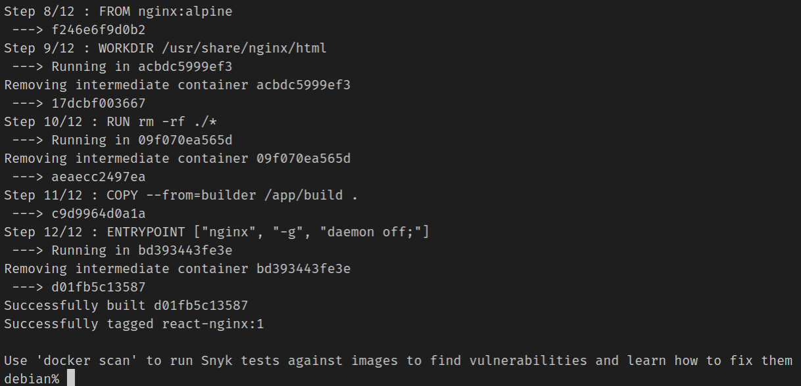

# Containerize Reactjs Application

Here we will employ a multi-stage build process to containerize a react application. The stages are as follows:- 
### Multi-stage build pipeline

- STAGE 1: Building assets using node image
- STAGE 2: Using nginx to serve the built assets


Let's begin with stage 1. We'll start with a node base image `node:14` and alias it as `builder`. It will be explained later why the aliasing was done.  
```dockerfile
FROM node:14 AS builder
```

Afterward, we'll set up the working directory. We'll use `/app` as the working directory but you can name it something else as well. 
```dockerfile
WORKDIR /app
```

Now, we'll copy the `package.json` and `yarn.lock` (or `package-lock.json`) to the working directory (`/app`) and install all the node modules using `yarn install` (or `npm install`). This will create a `node_modules` with all the dependency files. 
```dockerfile
COPY package.json .
COPY yarn.lock .
RUN yarn install
```
Once the node modules are installed, the contents of the current directory (`.`) will be copied over to the image's working directory (`/app`). Notice that the current environment may contain a `node_modules` folder and copying all contents will override the existing `node_modules` folder inside the docker image's working directory. So, this folder needs to be ignored. This can be done by creating a `.dockerignore` file in the root directory of the application and adding the line "`node_modules`". Once the copying is complete, the `yarn build` (or `npm run build`) will be executed to build all the assets in the `/build` directory.
```dockerfile
COPY . .
RUN yarn build
```

NOTE: it is possible to achieve the same result by copying over all the contents from the current directory to the docker image's `/app` directory and executing `yarn build && yarn install` directly. However, copying the `package.json` & `yarn.lock` and installing the node modules before starting the building process has an added advantage. It essentially allows the docker to cache the downloaded files. This allows a faster build time in the subsequent build of the application. 
```dockerfile
COPY . .
RUN yarn install && yarn build 
```


Now, let's begin stage 2 of the deployment process. Deploying a nodejs application with nginx can allow for various performance gains. Nginx can be used to implement reverse proxy, cache static files, load balancing etc. We start from `nginx:alpine` base image and change the image's working directory to `/usr/share/nginx/html`. `nginx` uses this directory to serve the content therefore we need to put the built files that were generated previously on stage 1. Before doing so we need to clean our current directory. 
```dockerfile
FROM nginx:alpine
WORKDIR /usr/share/nginx/html
RUN rm -rf ./*
```
Now, we'll copy all contents of `/build` directory of the image environment in stage 1. To do so, we need to somehow reference that building stage. In stage 1, we used '`FROM ... AS ...`' syntax to reference the stage as `builder`. Using `--from=builder` we can reference that stage and copy all the content to stage two's working directory i.e. `/usr/share/nginx/html`. Finally, we set the entry point to start serving the application.
```dockerfile
COPY --from=builder /app/build .
ENTRYPOINT ["nginx", "-g", "daemon off;"]
```

So, let's start by creating our first image. We can check if an image or container is already present using the following commands
To check for images
```bash 
docker images 
```


To check for running and stopped containers
```bash 
docker ps
docker ps -a 
```


No results were shown suggesting that no container is present. Now, we need to be in the root directory (`/dockerize-reactjs-app`) of the app to start building our image. 
```bash 
docker build -t react-nginx:1 . 
```
This will show the following output in the terminal. 



 
 You can see above that the overall build process was divided into 12 steps. Once the build process is done you can see the image using the following 

```bash
docker images
```


You can see that a new repository was created by the name `react-nginx` with an image id of `d01fb5c13587`. We'll be using this image id to create our image. Now, in order to build the container from our image file we need to add the following command 

```bash 
docker run d01fb5c13587
```
This will use the image with d01fb5c13587 to build the container. Althogh this command will spin up the image we wont be able to see the web app as the container by default inaccessible to outside. So, we need to expose a port of the container and map it to our local machine's port to see our app in action. we will map port 7001 of our local machine to container's port 80 as nginx by deafult listens to port 80.
```bash 
docker run -p 7001:80 d01fb5c13587
```


Now, if you open the browser and type http://localhost:7001/ you'll see the deployed app. Hurray, you've done it!


You can type `Ctrl + C` to stop the container. To check the stopped container type 
```bash
docker ps -a
```


Now, if you want to get rid of the container, you need to use the following

```bash
docker rm 8c270816ffbb
```
where `8c270816ffbb` is the container id.
By doing this the container will be removed.


We can also remove the image that was used to create the container using the following command

```bash
docker rmi d01fb5c13587
```


This will remove the image. 